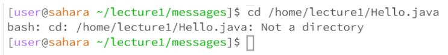

# Lab Report 1
***
For this Lab Report, I will be using the “lecture1” repository to show off the examples for each command.

**First command: cd**
1. An example of using the “cd” command without any arguments:
	
* Working Directory: In this case, the working directory was the initial working directory which can be referred to as home.
* There was no output, and the use case of the command “cd” with no arguments is to take you to your home directory, and as I already was in the home directory, there   was no change due to this command being run on the terminal.
* There was no error in the output.

2. An example of using “cd” with a path to a directory as an argument:
	
* Working directory: In this case, the working directory was still home, but starting from the next command, it would be the messages directory.
* There was no output again, the use case “cd” with a path to a directory is to switch the working directory to the directory specified in the path.
* There was no error in the output

3.An example of using “cd” with a path to a file as an argument
	
* Working directory: In this case, the working directory was messages which is a directory inside of lecture1. 
* The output was: “bash: cd: /home/lecture1.Hello.java: Not a directory,” and I got that output because we were trying to making the current directory a file which 
  is not possible.
* There was an error in the output because we use the “cd” command to switch the current working directory, and in this case, we were trying to switch it to a file   
  which is not a directory so we resulted in an error.

**Second command: ls**
1. An example of using “ls” without any argument:
	
* Working directory: In this case, the working directory was the initial working directory which is the home directory.
* The output was “lecture 1”, and command ls with no arguments prints out the directories and files under the current working directory. In this case, there was   
  only one directory under home, so it returned lecture1 as the output.
* There was no error

2. An example of using “ls” with a path to a directory as an argument:

* Working directory: In this case, the working directory was the initial working directory which is the home directory.
* The output was “Hello.java messages README,” and using ls with a path to a directory prints out the directories and files under the directory referred to in the 
  path. In this case, there were two files and one directory under lecture1 so it printed those out.
* There was no error

3. An example of using “ls” with a path to a file as an argument:

* Working directory: In this case, the working directory was the initial working directory which is the home directory.
* The output was “/home/lecture1/Hello.java” and using ls with a path to a file prints out the path to that file, which makes sense as there are no other     
  directories or files inside a file.
* There was no error

**Third Command: cat**
1.  An example of using the “cat” command without any arguments:    
	
* Working directory:  In this case, the working directory was the initial working directory which is the home directory.
* There was no output, this was in other words an error, but it did not print it out as an error as “cd” is supposed to print out contents of a file and there was 
  no argument of a file given so it resulted in no output
* There was an error because there was no path given to a file for it to print out

2. An example of using “cat” with a path to a file as an argument:

* Working directory: In this case, the working directory was lecture1.
* There was an error in the output because we gave it a directory for it to print out, and not a file.
* There was an error because “cat” prints out the contents of a file and in this case, we gave it a directory which meant it would result in an error

3. An example of using “cat” with a path to a directory as an argument:

* Working directory: In this case, the working directory was lecture1.
* The output was “Hello World!” which is exactly what was written in the file, and using the “cat” command with a path to the file prints out the content of the   
  file and in the file it is written “Hello World!” and it printed it out.
* There was no error 

