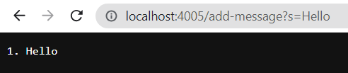
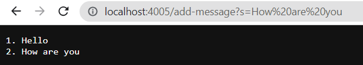
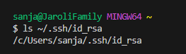
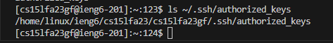
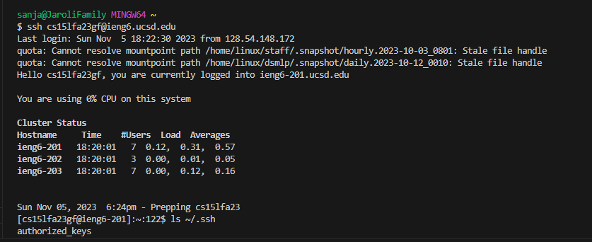

# Lab Report 2
***

**Part 1** <br>

My code for StringServer.java:
```
import java.io.IOException;
import java.net.URI;
import java.util.ArrayList;
import java.util.List;

class Handler implements URLHandler {

    List<String> messages = new ArrayList<>();
    int sequence = 1;

    public String handleRequest(URI url) {
        if (url.getPath().equals("/add-message")) {
            String query = url.getQuery();
            if (query != null && query.startsWith("s=")) {
                String newMessage = sequence + ". " + message;
                messages.add(newMessage);
                sequence++;
                return String.join("\n", messages);
            }
        }
        return "404 Not Found!";
    }
}

class StringServer {
   
    public static void main(String[] args) throws IOException {
        if (args.length == 0) {
            System.out.println("Missing port number! Try any number between 1024 to 49151");
            return;
        }
        int port = Integer.parseInt(args[0]);

        Server.start(port, new Handler());
    }
}
```
Screenshot 1 (Adding Hello): <br>
	

* Method called: handleRequest(URI url) in the Handler class is called.
* Relevant arguments: "URI" object representing the URL (http://localhost:4005/add-message?s=Hello) with path "/add-message" and query "s=Hello".
* Relevant fields: 'messages' which is an empty list before the code is ran, and the 'sequence' is 1.
* How the values change: The 'messages' list will have one element added which would be taken from the query: "1.Hello" and "sequece" will increment to 2.

Screenshot 2 (Adding How Are you): <br>
	

* Method called: handleRequest(URI url) in the Handler class is called.
* Relevant arguments: "URI" object representing the URL (http://localhost:4005/add-message?s=How%20are%20you) with path "/add-message" and query "s=How are you".
* Relevant fields: 'messages' which is a list with an element "1.Hello" from the previous request, and the 'sequence' is 2 due to adding "1.Hello".
* How the values change: The messages list will have two elements: "1. Hello" and "2. How are you", and sequence will increment to 3.

**Part 2** <br>
* The path to the private key for your SSH key for logging into ieng6 (on your computer or on the home directory of the lab computer): <br>
	

* The path to the public key for your SSH key for logging into ieng6 (within your account on ieng6): <br>
	

* A terminal interaction where you log into ieng6 with your course-specific account without being asked for a password.
	


