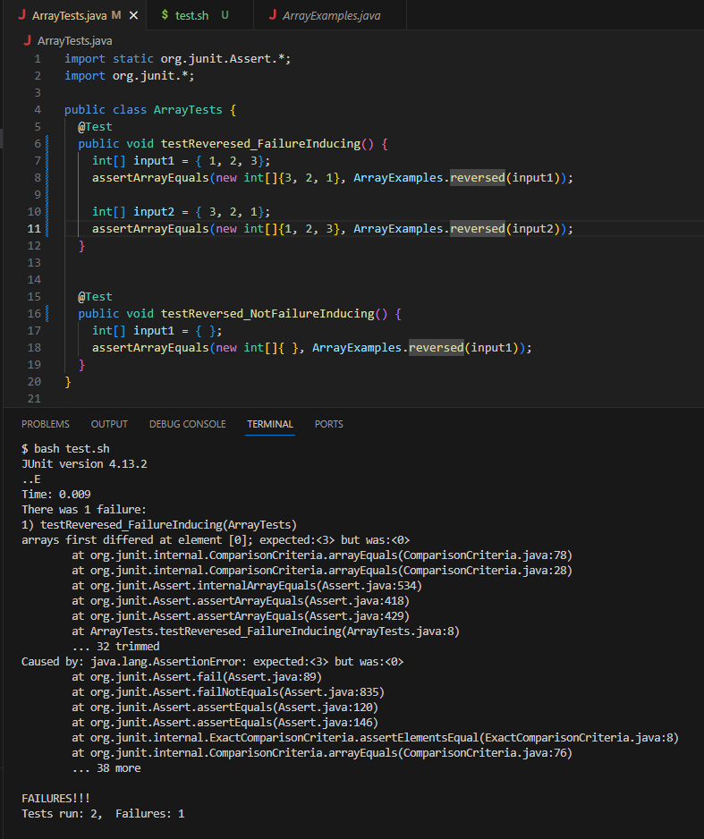

# Lab Report 3
***

**Part 1** <br>

The bug I chose from Lab1 (ArrayTests.java) is testReveresed():

* A failure-inducing input for the buggy program, as a JUnit test and any associated code:
```
@Test
public void testReversedFailureInducing) {
    int[] input1 = {1, 2, 3};
    assertArrayEquals(new int[]{3, 2, 1}, ArrayExamples.reverseInPlace(input1));
}
```

* An input that doesn’t induce a failure, as a JUnit test and any associated code:
```
@Test
public void testReversedNotFailureInducing() {
    int[] input1 = { };
    assertArrayEquals(new int[]{ }, ArrayExamples.reverseInPlace(input1));
}
```
* The symptom, as the output of running the tests:
	

* The bug, as the before-and-after code change required to fix it:
    - Before:
      ```
        static int[] reversed(int[] arr) {
        int[] newArray = new int[arr.length];
        for(int i = 0; i < arr.length; i += 1) {
          arr[i] = newArray[arr.length - i - 1];
        }
        return arr;
      }
    - After:
      ```
        static int[] reversed(int[] arr) {
        int[] newArray = new int[arr.length];
        for(int i = 0; i < arr.length; i += 1) {
            newArray[i] = arr[arr.length - i - 1];
        }
        return newArray;
        }
    - Explanation: The bug in the original reversed method is that it modifies the arr array itself, which should not be changed. To fix it, the code I implemented assigns the reversed elements to the newArray and returns the newArray.
 
**Part 2:** <br>

Command 1: -size

Example 1 - Find all files less than 2 KB in technical.
Command: 
```
find ./technical -type f -size -2k
```
Output:
```
./technical/biomed-sizes.txt
./technical/plos/pmed.0020191.txt
./technical/plos/pmed.0020226.txt
```
<br>

Example 2 - Find all files more than 50 KB in technical.
Command:
```
find ./technical -type f -size +50k
```

Output:
```
./technical/biomed/1471-2156-3-17.txt
./technical/biomed/1472-684X-1-5.txt
./technical/biomed/gb-2001-2-8-research0030.txt
./technical/biomed/gb-2002-3-5-research0025.txt
./technical/government/Gen_Account_Office/Paper_Walker11-2002_acpro122.txt
```

Explanation: The first example filters out files less than 5 KB and the second example filters out files greater than 50 KB. This is great for filtering file ranges and excludes files that are too small or big for usage. The uses cases of -size include finding large files on your system, finding empty files, and just filtering through files for optimized usage. 
<br>

**Command 2: - type**
Example 1 - Find all directories in the current directory:
Command:
```
find ./technical -type d
```
Output:
```
./technical
./technical/911report
./technical/biomed
./technical/government
./technical/government/About_LSC
./technical/government/Alcohol_Problems
./technical/government/Env_Prot_Agen
./technical/government/Gen_Account_Office
./technical/government/Media
./technical/government/Post_Rate_Comm
./technical/plos
```
Example 2 - Find all regular files under a directory: <br>

Command:
```
find ./technical -type f
```
Output:
```
.....
./technical/plos/pmed.0020272.txt
./technical/plos/pmed.0020273.txt
./technical/plos/pmed.0020274.txt
./technical/plos/pmed.0020275.txt
./technical/plos/pmed.0020278.txt
./technical/plos/pmed.0020281.txt
```

Explanation:  The -type option allows you to specify the type of file or directory you want to search for.  It enables filtering based on characteristics like regular files, directories, and other specific types. The provided examples demonstrate its application in listing all directories within the 'technical' directory (Example 1) and extracting files (the last few due to being too many files in technical) within 'technical' (Example 2). The use case of the -type feature is for tasks like file organization, targeted searches, and management of distinct file categories.


<br>

**Command 3: - name** <br>
Example 1 -Find all files and directories with names starting with "grep" in the current directory:
<br>
Command:
```
find ./technical -name "grep*"
```
Output:
```
./technical/grep-results.txt
```

Example 2 - Find a specific file given its name:
```
find ./technical -name "grep-results.txt*"
```
Output:
```
./technical/grep-results.txt
```

Explanation: In example one, we try to find the find all files/directories starting with "grep". In example two, we try to find a specific file in the directory given its' name. The use cases for -name include customized searches, finding and organizing files, searching for file types, and much more.
<br>

**Command 4: - maxdepth** <br>
Example 1 - Find all files in the current directory but not in its subdirectories:
<br>
Command:
```
find ./technical -maxdepth 1 -type f
```
Output:
```
./technical/biomed-sizes.txt
./technical/find-results.txt
./technical/grep-results.txt
```

Example 2 - Find all directories in the directory as well as the subdirectories inside the directories.
```
find ./technical -maxdepth 2 -type d
```
Output:
```
./technical
./technical/911report
./technical/biomed
./technical/government
./technical/government/About_LSC
./technical/government/Alcohol_Problems
./technical/government/Env_Prot_Agen
./technical/government/Gen_Account_Office
./technical/government/Media
./technical/government/Post_Rate_Comm
./technical/plos
```

Explanation: In example one, we try to find the find all files in technical excluding subdirectories of technical. In example two, we try to find directories in technincal and subdirectories within those directories.This functionality is useful when you wish to limit your search scope within a complex directory structure, avoiding deep searches into numerous subdirectories or targeting directories at a specific depth level.


