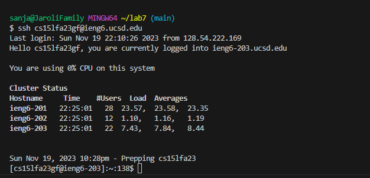
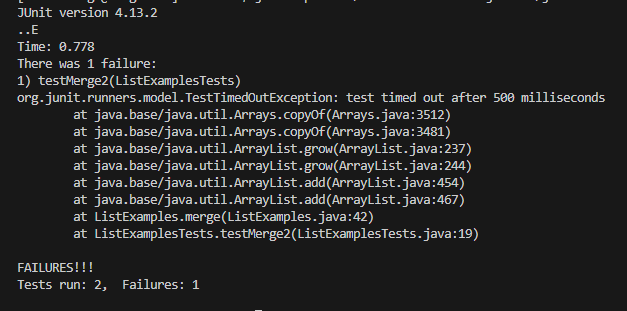
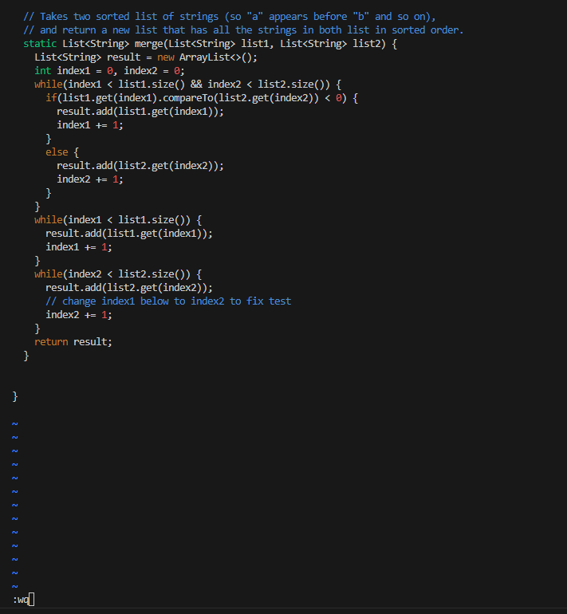
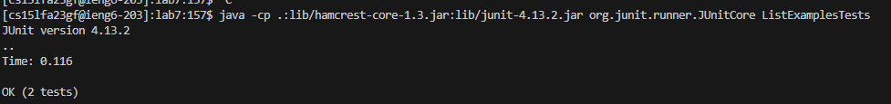
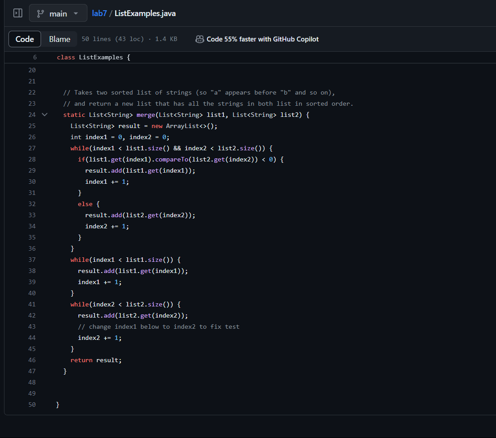

# Lab Report 4
***

Step 4: <br>
	

Keys Pressed:
```
<up><enter>
ssh cs15lfa23gf@ieng6.ucsd.edu 
```
The command was the last command I used to log in, so I had to just log in again by doing up and then enter.

Step 5: <br>


Keys Pressed:
```
<click><ctrl-v><enter>
git clone git@github.com:gjaroli04/lab7.git
```

I clicked the copy button on GitHub to copy the repository, then typed in 'git clone' then pasted the repository link using 'ctrl-v'.

Step 6: <br>
	

```
<up><up><enter>, <up><up><enter> 
javac -cp .:lib/hamcrest-core-1.3.jar:lib/junit-4.13.2.jar *.java
java -cp .:lib/hamcrest-core-1.3.jar:lib/junit-4.13.2.jar org.junit.runner.JUnitCore ListExamplesTests 
```
These commands were 2 up in the command history so I pressed up two times to access the command and then pressed enter

Step 7: <br>
	

```
<enter><?index1><enter><e><r><2><esc><:wq><enter>
vim ListExamples.java
```

After typing vim ListExamples.java, I pressed "enter" and then I typed in "?index1" which took me to the last 'index1' in the file, which happens to be the one that we are supposed to fix. Then I clicked enter to go to that spot and then pressed "e" to go to the end of "index1" and used 'r2' to replace the 1 with 2 and then I pressed "esc" and then typed in ":wq" and then pressed "enter" to save changes. I did this to make it so that I had the least amount of key presses that I could think of. 


Step 8: <br>
	
```
<up><up><enter>
java -cp .:lib/hamcrest-core-1.3.jar:lib/junit-4.13.2.jar org.junit.runner.JUnitCore ListExamplesTests
```
I pressed up twice to get the command that ran tests.

Step 9: <br>
	

```
<git><add><tab><enter> <ctrl-c><ctrl-v><enter> <git><push><tab><main><enter>
git add ListExamples.java
git commit -m "Fix failing test by changing index1 to index2"
git push origin main
```

To better optimize this, I first typed out "git add" and then pressed "tab" which provided me the filename and then I pressed "enter" to execute the first command. Next, I had this command written in a document, and I pressed "ctrl-c" to copy it from there and then pasted it using "ctrl-v" and then pressed "enter" to excecute the command. Next, I typed out "git push" and then pressed "tab" which filled out "origin" and then I typed out "main" and then pressed "enter" to execute the command. 

