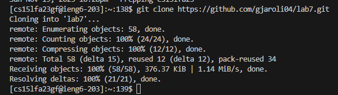

# Lab Report 4
***

Step 4: <br>
	

Keys Pressed:
```
<up><enter>
ssh cs15lfa23gf@ieng6.ucsd.edu 
```
The command was the last command I used to log in, so I had to just log in again bu doing up and then enter.

Step 5: <br>
	

Keys Pressed:
```
<up><enter>
git clone https://github.com/gjaroli04/lab7.git
```
The command was just above in my command history so I just went up and cloned this directory

Step 6: <br>
	

```
<up><up><enter>, <up><up><enter> 
javac -cp .:lib/hamcrest-core-1.3.jar:lib/junit-4.13.2.jar *.java
java -cp .:lib/hamcrest-core-1.3.jar:lib/junit-4.13.2.jar org.junit.runner.JUnitCore ListExamplesTests 
```
These commands were 2 up in the command history so I pressed up two times to access the command and then pressed enter

Step 7: <br>
	

```
<enter><i><click><esc><enter>
vim ListExamples.java
```

After typing vim ListExamples.java, I pressed enter and then went to insert mode by pressing 'i' and then clicking to index1 and changed it to index2, and then I pressed 'esc' and typed ':wq' and then "enter" to save changes


Step 8: <br>
	
```
<up><up><enter>
java -cp .:lib/hamcrest-core-1.3.jar:lib/junit-4.13.2.jar org.junit.runner.JUnitCore ListExamplesTests
```
I pressed up twice to get the command that ran tests.

Step 9: <br>
	
```
<enter><enter><enter>
git add ListExamples.java
git commit -m "Fix failing test by changing index1 to index2"
git push origin main
```

I typed out these commands and pressed enter after this.
